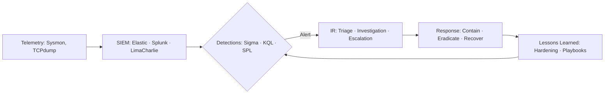

<!-- HEADER: animated banner + typing line -->

  

  

<!-- QUICK CONTACT BADGES -->

  
  
  

---

## 🛰️ About
I’m **Andrew Wycliffe Kola**, a Security Analyst in the making with a **Master’s in Cybersecurity & Information Systems**.  
My focus: **endpoint security, SOC operations, threat detection, and incident response**—with a side of **AI-driven automation**.

- 🛡️ **Hands-on Projects**: SOC Analyst Home Lab, Python Keylogger Simulation, AI-Powered Incident Responder  
- 🔍 **Skills**: Threat hunting, SIEM workflows, log analysis, incident triage, and malware behavior analysis  
- 🤖 **AI + Security**: Built detection packs and incident responders powered by **Google Gemini APIs + n8n**  
- 🌐 **Extras**: Background in web dev + DB management gives me an appsec/data perspective  

---

## 🧰 Tech Stack
**Security & Monitoring:** Splunk · Elastic · LimaCharlie EDR · Wireshark · TCPdump · Sysmon 
**IR & Threat Hunting:** Sigma · KQL · MITRE ATT&CK mapping · Log analysis · Triage workflows  
**IAM:** Active Directory (user/group policies, endpoint hardening)  
**Cloud & Virtualization:** AWS IAM · Azure VM configs · VMware · Hyper-V · VirtualBox  
**Programming & Automation:** Python · PowerShell · Bash · n8n automation · HTML/CSS/JS  
**Other:** SOP writing · Incident documentation · Process improvement  

---

## 🗺️ SOC Workflow Map

---

## 🔬 Featured Projects
- 🔹 [**DetectPack Forge**](https://github.com/andrewkolagit/DetectPack-Forge) → Turns plain-English behaviors into detection packs (Sigma/KQL/SPL) with AI-powered schema inference + MITRE ATT&CK mapping.  
- 🔹 [**AI-Powered Incident Responder**](https://github.com/andrewkolagit/AI-Powered-Incident-Responder) → Automated incident detection, analysis, and reporting using Gemini + n8n workflows.  
- 🔹 [**My SOC Analyst Home Lab**](https://github.com/andrewkolagit/My-SOC-Analyst-Home-Lab) → Virtualized SOC with LimaCharlie + Sliver C2 for attack/defense simulations, detections, and IR runbooks.  
- 🔹 [**Python Keylogger Project**](https://github.com/andrewkolagit/Python-Keylogger-Project) → Malware simulation for telemetry + defense testing in a safe, controlled lab.  

---

## 📈 GitHub Stats

  
  

  

---

## 🤝 Let’s Connect
📫 **Email**: andrewkola13@gmail.com  
💼 **LinkedIn**: [linkedin.com/in/andrew-kola-79386a126](https://www.linkedin.com/in/andrew-kola-79386a126)  
🌐 **GitHub**: [github.com/andrewkolagit](https://github.com/andrewkolagit)  

---
✨ *Collect events → Ask good questions → Tell the story → Secure the system.*
