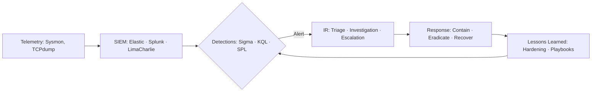

<!-- HEADER: animated banner + typing line -->

  

## 🤝 Connect with me!

  
  
  

---

## 🛰️ About
I’m **Andrew Wycliffe Kola**, a Security Analyst in the making (M.S. in Cybersecurity & Information Systems). I focus on **endpoint security, SOC operations, threat detection, and incident response**—and I like using **automation/LLMs** to cut toil and speed investigations.
My focus: **endpoint security, SOC operations, threat detection, and incident response**—with a side of **AI-driven automation**.

- 🛡️ **Hands-on Projects**: SOC Analyst Home Lab, Python Keylogger Simulation, AI-Powered Incident Responder  
- 🔍 **Skills**: Threat hunting, SIEM workflows, log analysis, incident triage, and malware behavior analysis  
- 🤖 **AI + Security**: Built detection packs and incident responders powered by **Google Gemini APIs + n8n**  
- 🌐 **Extras**: Background in web dev + DB management gives me an appsec/data perspective  

---

## 🧰 Security Toolkit
**Security & Monitoring:** Splunk · Elastic · LimaCharlie EDR · Wireshark · TCPdump · Sysmon 
**IR & Threat Hunting:** Sigma · KQL · MITRE ATT&CK mapping · Log analysis · Triage workflows  
**IAM:** Active Directory (user/group policies, endpoint hardening)  
**Cloud & Virtualization:** AWS IAM · Azure VM configs · VMware · Hyper-V · VirtualBox  
**Programming & Automation:** Python · PowerShell · Bash · n8n automation · HTML/CSS/JS  
**Other:** SOP writing · Incident documentation · Process improvement  

---

## 🗺️ SOC Workflow Map

---

## 🔬 Products

   
  Plain-English behaviors ➜ detection packs (Sigma/KQL/SPL) with AI-powered schema inference + MITRE ATT&CK mapping.

   
  Automated detection → analysis → reporting using Gemini + n8n; outputs to Gmail/Google Sheets.

   
  Virtualized SOC with LimaCharlie + Sliver C2 for attack/defense sims, detections, and IR runbooks.

   
  Controlled malware simulation to study telemetry and defensive controls.

---

## 📈 GitHub Stats
## 📈 GitHub Stats

  
  

  

